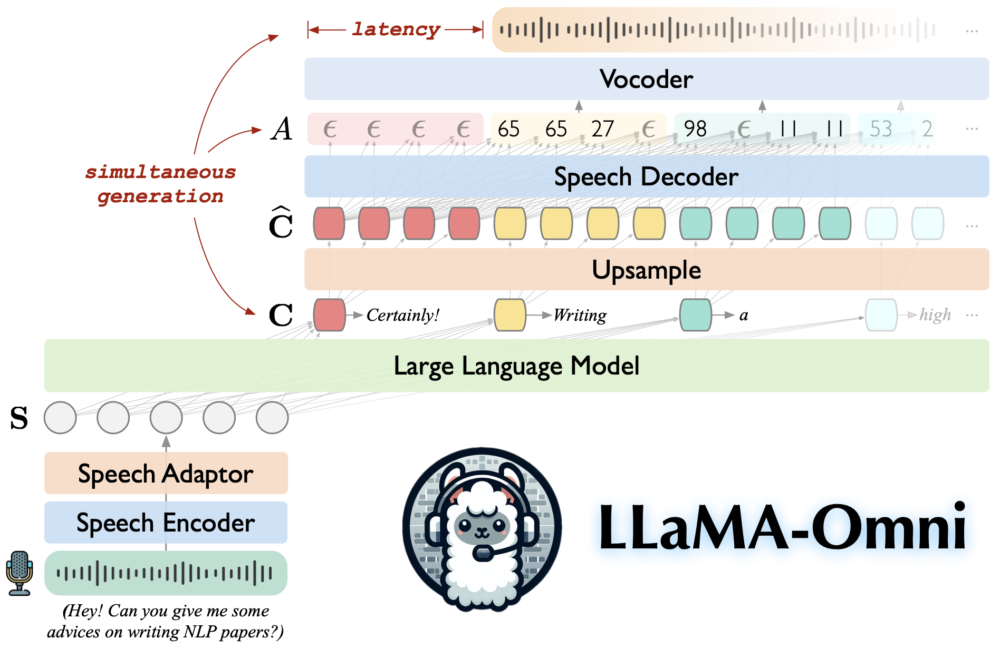

# 🦙🎧 LLaMA-Omni: Seamless Speech Interaction with Large Language Models

> **Authors: [Qingkai Fang](https://fangqingkai.github.io/), [Shoutao Guo](https://scholar.google.com/citations?hl=en&user=XwHtPyAAAAAJ), [Yan Zhou](https://zhouyan19.github.io/zhouyan/), [Zhengrui Ma](https://scholar.google.com.hk/citations?user=dUgq6tEAAAAJ), [Shaolei Zhang](https://zhangshaolei1998.github.io/), [Yang Feng*](https://people.ucas.edu.cn/~yangfeng?language=en)**

[](https://arxiv.org/abs/2409.06666)
[](https://huggingface.co/ICTNLP/Llama-3.1-8B-Omni)
[](https://github.com/ictnlp/LLaMA-Omni)


LLaMA-Omni is a speech-language model built upon Llama-3.1-8B-Instruct. It supports low-latency and high-quality speech interactions, simultaneously generating both text and speech responses based on speech instructions.

<div align="center"></div>

## 💡 Highlights

- 💪 **Built on Llama-3.1-8B-Instruct, ensuring high-quality responses.**

- 🚀 **Low-latency speech interaction with a latency as low as 226ms.**

- 🎧 **Simultaneous generation of both text and speech responses.**

- ♻️ **Trained in less than 3 days using just 4 GPUs.**

https://github.com/user-attachments/assets/2b097af8-47d7-494f-b3b3-6be17ca0247a

## Install

1. Clone this repository.

```shell
git clone https://github.com/ictnlp/LLaMA-Omni
cd LLaMA-Omni
```

2. Install packages.

```shell
conda create -n llama-omni python=3.10
conda activate llama-omni
pip install pip==24.0
pip install -e .
```

3. Install `fairseq`.

```shell
git clone https://github.com/pytorch/fairseq
cd fairseq
pip install -e . --no-build-isolation
```

4. Install `flash-attention`.

```shell
pip install flash-attn --no-build-isolation
```

## Quick Start

1. Download the `Llama-3.1-8B-Omni` model from 🤗[Huggingface](https://huggingface.co/ICTNLP/Llama-3.1-8B-Omni). 

2. Download the `Whisper-large-v3` model.

```shell
import whisper
model = whisper.load_model("large-v3", download_root="models/speech_encoder/")
```

3. Download the unit-based HiFi-GAN vocoder.

```shell
wget https://dl.fbaipublicfiles.com/fairseq/speech_to_speech/vocoder/code_hifigan/mhubert_vp_en_es_fr_it3_400k_layer11_km1000_lj/g_00500000 -P vocoder/
wget https://dl.fbaipublicfiles.com/fairseq/speech_to_speech/vocoder/code_hifigan/mhubert_vp_en_es_fr_it3_400k_layer11_km1000_lj/config.json -P vocoder/
```

## Gradio Demo

1. Launch a controller.
```shell
python -m omni_speech.serve.controller --host 0.0.0.0 --port 10000
```

2. Launch a gradio web server.
```shell
python -m omni_speech.serve.gradio_web_server --controller http://localhost:10000 --port 8000 --model-list-mode reload --vocoder vocoder/g_00500000 --vocoder-cfg vocoder/config.json
```

3. Launch a model worker.
```shell
python -m omni_speech.serve.model_worker --host 0.0.0.0 --controller http://localhost:10000 --port 40000 --worker http://localhost:40000 --model-path Llama-3.1-8B-Omni --model-name Llama-3.1-8B-Omni --s2s
```

4. Visit [http://localhost:8000/](http://localhost:8000/) and interact with LLaMA-3.1-8B-Omni!

**Note: Due to the instability of streaming audio playback in Gradio, we have only implemented streaming audio synthesis without enabling autoplay. If you have a good solution, feel free to submit a PR. Thanks!**

## Local Inference

To run inference locally, please organize the speech instruction files according to the format in the `omni_speech/infer/examples` directory, then refer to the following script.
```shell
bash omni_speech/infer/run.sh omni_speech/infer/examples
```

## Acknowledgements

- [LLaVA](https://github.com/haotian-liu/LLaVA): The codebase we built upon.
- [SLAM-LLM](https://github.com/X-LANCE/SLAM-LLM): We borrow some code about speech encoder and speech adaptor.

## Citation

If you have any questions, please feel free to submit an issue or contact `fangqingkai21b@ict.ac.cn`.

If our work is useful for you, please cite as:

```
@article{fang-etal-2024-llama-omni,
  title={LLaMA-Omni: Seamless Speech Interaction with Large Language Models},
  author={Fang, Qingkai and Guo, Shoutao and Zhou, Yan and Ma, Zhengrui and Zhang, Shaolei and Feng, Yang},
  journal={arXiv preprint arXiv:2409.06666},
  year={2024}
}
```
